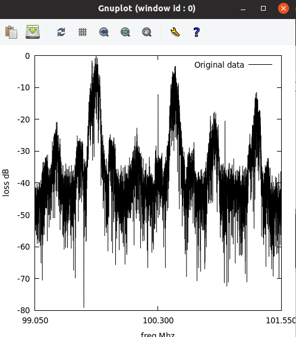
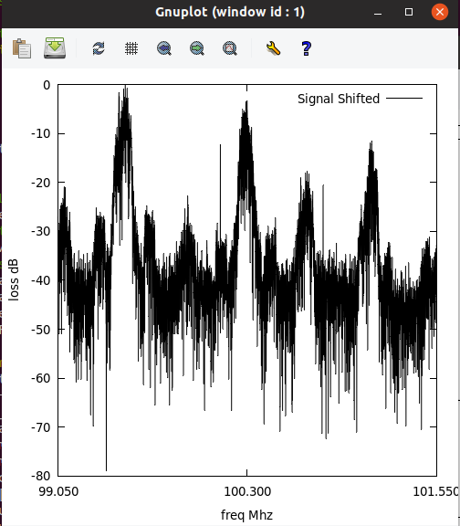
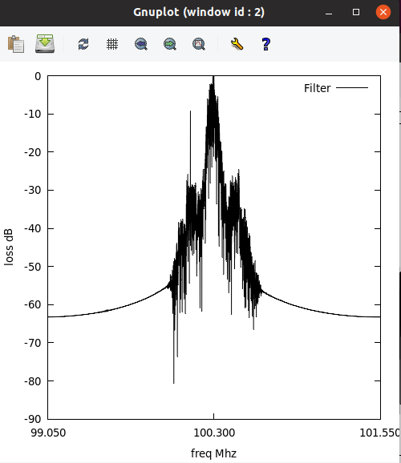
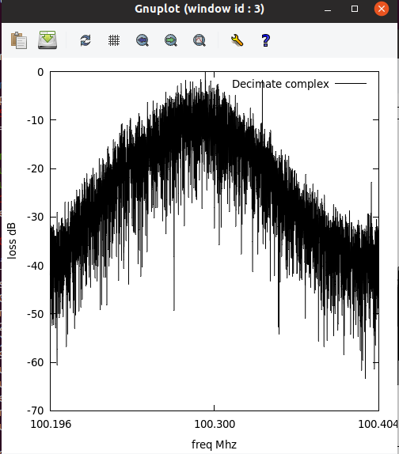
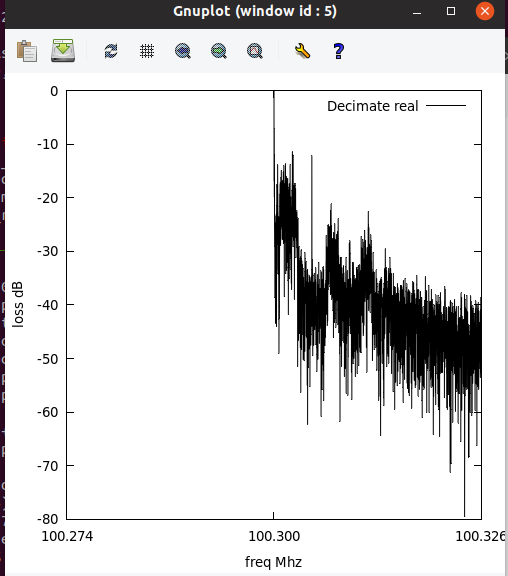
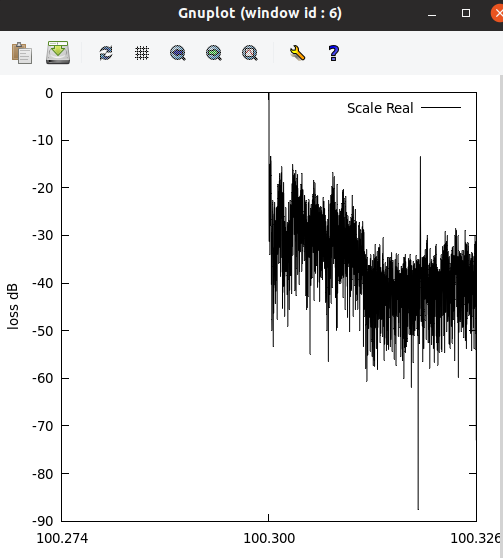

# Overview 

The goal of this project is to decode radio signalling data from a RTL-SDR. This is a brand
of Softward defined radio that is really popular. The device is capabable of doing the 
Radio front end signal capture and it is going to be our job to ingest this data and attempt
to generate a FM audio output. 

# Understand the input

We have a interesting data source from FMCapture1.dat. This file contains IQ sample data
from a RTL-SDR. IQ data which was sampled with the follow parameters

Freq center = 100.112 Mhz  = F_c
Freq sample rate = 2.5 Mhz = F_r
Number of samples = 25Million = n     the sample is 10seconds long

Thus we have 25M IQ samples which each IQ sample is 2 uint8_t they need to be converted
to signed data since the really represent the complex value of the signal at a given time
i.e 

z = I + iQ = a cos(theta) + i b sin(theta) = re^(i theta)

    Here theta is the sample's frequency at the time that number was sampled

# Theory to decoding

I'll now outline the plane to decode and the motivation for the underlying cuda kernels used

## Sample data:  X_1 = RTL_sample(f_c, f_r, n) 

This is the data the RTL-SDR will generate when we tune it. It gets length n and we display
above the FFT of this data. I will show the FFT of the data after the given headers step
has run to make things clear.

## Mix to Baseband: X_2 = X_1 * e^(i f_d)   

I know aprori there is a FM signal at 100.3, 101.1,... MHz. In order to get the signal out
We need to center samples to f_t or our target frequency. This means we need to do a phase
shift or multiple our complex numbers by the given downshift amount. Because we are sampling
at 2.5 MHz our delta shift freq should be in MHz. 
 Thus the following parameters make sense

f_t = 100.3 ->  f_d = f_t - f_c  =  100.3 - 100.122 =  0.178 MHz 
f_t =  99.5 ->  f_d = f_t - f_c  =   99.5 - 100.122 = -0.622 Mhz
f_t = 101.1 ->  f_d = f_t - f_c  =  101.1 - 100.122 =  0.978 Mhz

These are the strongest signals in our data. This is clear if you look at a spectrogram of 
the data. 

## Low Pass Filter:  X_3 = conv(X_2, H)

This is the first math heavy step. We want to smooth the data an remove high frequency
artifacts and other stations from our output. To do this we need to run a FIR filter on our
data. Or convolute our data with a blackman window. This is equal to computing the following

X_3[n] = SUM(k=0, n=|H|, H[k] * X[n-k])

This is is a discrete sum and the H matrix is a series of coefficients for our filter. They 
are independent of the target freqency so we can treat them as constants no matter the station
we want to tune to. This is because we are always acting on the Baseband freqency we generated
with the last step. I used a reference to generate those constants. 

Now one thing of note here is that in order to filter the above IQ data we need to run
our FIR filter on both the I and Q parts. Which is much easier than making a complex filter
Remember our data is complex because we multiplied it by cos,sin in the RF front end. Its not
"really" complex execpt when we want it to be. 

## Downsample  X_4 = X_3[0:n:D]

We have a lot of data because we sampled at 2.5 Mhz FM bandwidth is only around 200 Khz. Thus
at this point we can reduce the data we have by downsampling without any lost. We simply splice
the array of data and reduce it to be smaller. Notable the following are chaning f_r is now 
lower for all future calculation

D = Decimation rate = round_down(f_s /f_fmbw) =  round_down(2.5MHz/ 200 KHz) = 12
X_4 = X_3[0:n:D]

Thus we end up with 12x less data whose sample rate is at 200 KHz

## Demodulate:  X_5 = 

We now have wideband FM data in X_4 thus we can attempt to demodulate it. If you open
up a DSP text book method one will say we can do the arctanget of Q/I to get theta and
calculate the derivative of theta to get X_5 i.e demodulated data. However I plan to 
eventually put this design into a FPGA so we are going to not do that. Instead I am 
advocating for plan 2 found in ref[5]. We will take the derivate of the equation i.e

Let z(t) = I(t) + iQ(t)   where I,Q are our quadratures.  We are interested the derivate of $theta(t)$. Method 1:     $\theta(t) = \tan^{-1}(\frac{Q(t)}{I{t}})$  and with a differentiator we can find $\frac{\delta\theta(t)}{dt} = \theta(t) - \theta(t-1)$.  This works but arctangent is a large and difficult function so we can take the derivate of $\theta(t)$ as follows.

\theta = tan^{-1}(\frac{Q}{I}) 
\frac{d}{dt}\theta = \frac{d}{dt} tan^{-1}(\frac{Q}{I})
\frac{\delta\theta}{dt}=  \frac{I \frac{dQ}{dt}  - Q \frac{dI}{dt}}{ I^2  + Q^2} 

This is easy to compute even on a FPGA since it is only scalar multiplications! Thus X_5 
will be demodulated audio you'll notice the FFT now only has have of its side thats because
by demoduling we have thrown out half our signal. Audio data is real valued data not 
complex thus our FFTs going forward will only show half as much. 

## Downconvert to Audio X_6 = X_5[0:n:dec]

We downconvert X_5 to a mono audio the same way as before. Our audio bandwidth 
is Freq = 44.1 KHz

## Volume Scale the data   X_7  = scale X_6 

We now will scale X_6 so we don't blow out our speaker out when we play the audio. 
We are simpling normalizing and scaling by 10K.

## Play audio!!

Now we can play the audio by printing to a file the data as int16 data. I've done this
in the audio.out file its 10 seconds from the FM transmission sample i got from online
the quality is surprisingly high. To play it run the following

$ aplay -f S16_LE -r 44100 -c2 audio.out

# References 
[1] http://www.aaronscher.com/wireless_com_SDR/RTL_SDR_AM_spectrum_demod.html
    This is the source of our sample data mainly because he did this in MatLab
    but also he has pictures so it is the control to our experiment. He used a lot of
    Predefines so his work has many limitations and it runs in MatLab!

[2] https://witestlab.poly.edu/blog/capture-and-decode-fm-radio/
    This lady describes how to do this in the python world but also has helped form a 
    great block diagram for the things that need to be down in a vector like notation
    which was critical to generating the pipeline for data. In this project

[3] https://tomroelandts.com/articles/how-to-create-a-simple-low-pass-filter

    This man showed me how to generate a Blackman windows coefficents I used his tool
    to generate filters used in the code

[4] https://sestevenson.wordpress.com/implementation-of-fir-filtering-in-c-part-1/

    This man helped me understand the equations needed to generate a Filter and did a 
    basic c implementation which was important because the math involved is really difficult
    I am not an EE person but I am a Math person. If someone can tell me the general idea
    I can probably implement it. 

[5]  https://www.embedded.com/dsp-tricks-frequency-demodulation-algorithms/#:~:text=An%20often%20used%20technique%20for,in%20Figure%2013%E2%80%9360%20below%20/ 

    I original planned on doing a PDS i.e theta =  arctan(Q/I),  dTheta = theta(t) - theta(t-1).  However I had problems with scaling here so I instead used a method described here.
