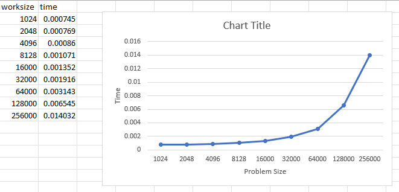

##  Overview

The analysis is light due to the size/type of the problem. Overall this assignment is exercising
our understanding of opencl so its important to establish a baseline. The graph below is
to be expected because as we exponentially increase the data time the exec time should
tend that way as well. These are still blazing fast however. I think that if the kernels
used were more complex you would see better execution. This time is compressing 4 kernels
where the memory is memcpy to the GPU 4 times. And since the operation is sample we are mostly
seeing the bandwidth to transfer here not the execution power of the GPU. 
