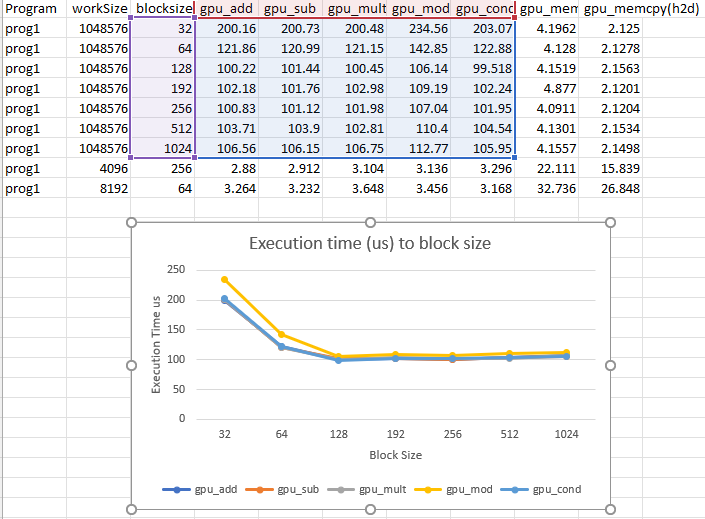

### Running
To run the program simply run make. This will generate a CSV containg
Running time statistics for each run. Note i do strip the us, ns, ms labels
because it was causes issues with excel. In the final CSV I plot everything
execpt for memcpy because that was constant across runs. 

assignment.exe <N> <blocksize>

## Analysis
First i'll show our graph

If one looks at the graph they will notice every line basically plots on top 
of each other. This implies on these basic operations there is not much 
variation even in the conditional. I link this to how small the programs are
while they might execute on 2^20 elements it is lightening quick because
I parallized every element be run by a thread. I think the invariance of the 
differences between kernels is also because they are tiny kernels so even
if stalls happen they never flush the instruction cache because the whole 
program can fit there. Beyond this the obvious thing happens when we schedule
a with a block size that matches our GPU better performance increases and when
we start have blocks that are getting to big performance slows ever so slightly.

## Bad code review

There are a couple of issues i have with the code. The first is its incompleteness,
We do not see the defintion for N nor comments explaining anything that is happening.
I also think using c++ stdlib timers doesn't really show much because they end before
we have access to the data. The kernel submisssion does not include getting the data
back to the user which could be okay but the author says nothing about it. I think 
another issue is everything is allocated on the stack if N >= 2<<20 you would like
have a massive stack overflow and crash. Finally I think because the data is static
it would be faster to allocate and setup with a kernel. 
