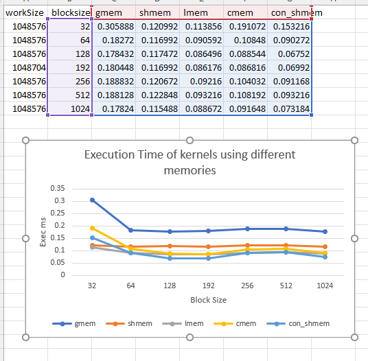

# Analysis

This was very interesting assignemtn and the graph above shows the power of using shared memory and the importance of placing memory in the right place. To start with global memory is clearly the slowest and this makes sense as our results are calculated series and if we keep our a and b values in shared memory we reduce the access to global memory by 6 * 2^20 runs this makes a huge in performance. The most interesting part though is the flatness of shared memory throughout every blocksize. This leads me to think that performance is more restricted by memory time than compute time. Since adding more blcosk has almost zero effect on performance. I could be wrong but I think this tends to hold true. If we go to the more extreme examples of using the literals, constant, and constant+shmem we can see performance is a little more variable this leads me to think that caching is having a bigger effect here since when we take a performance hit at 256,512 it implies to me that we are thrashing the cache more where as when we are at 1024 we are having more level access patterns again. All these benchmarks are using a compute bounded hash but using constant and shmem together beat even the literals at higher block size. All in all this was very interesting. 

# Extra problem

I think that this test is missing a comparsion to literal memory. I also think its doing a weird copy to shared memory. whats the point of a loop just make the access pattern so that a block copies everything to memory based on tids. If problems are too big just add more blocks to launch. Its unlikely that you will fit all of your N problem  * 3 into memory at any given time but fitting it in blocks at a time seems more mangable. Also this only uses add in the kernel the assignment asked for 4 different opperations at least.

