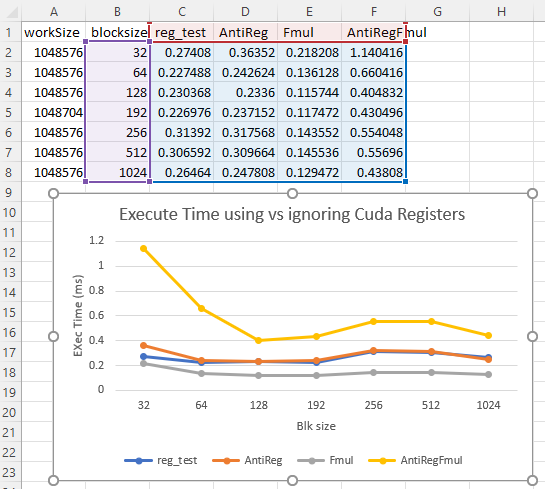

# Analysis

We have 2 experiements running here. The first was doing basic arithmatic operations using
registers verse not. And second experient is the same thing however instead of using
basic operations we calulate GF(2^8) multiplication. This is the type used in AES 
defined in the FIPS manual and its applications are bigger than just AES. Its 
a longer operations. The motivation behind this choice is to demonstrate the full power
of using registers with out there advantage being masked by the fact that we don't do many
operations. It was also to practice writing a more complex calculation. I think the the 
results speak for themselves. When doing something basic we don't really see any benefit
because we are relatively bounded in the use of registers and the majority of the work is
in loading memory and thus the performance has no gain. However, the fun part is that when
we do something slightly more complex avoiding register, which made it easier to write, We
see a 3-5x difference in run time. This tread would likely continue to grow if we calculated
something even more complex using more registers. It just goes to show how signifcant using
the right time of memory is. Registers are way faster so when we can use them we should.  

# Extra problem

I think the problem is little misleading I like how short the functions are but the names
are misleading. I see Fill matrix where yes we fill a matrixs but we don't appear to 
ever being doing a matrix operations. Not to mention we pin memory for a h_coeff matrix
that we just never use. I was envisiong by reading that code we would be doing y =mx where
y and x are matrixs such that m is vector multipling each element of X but it was hard to
follow because the functions had just kinda generic comments mostly about the memory used
but not the actually calculation happening. They also used atomicAdd which was confusing 
because I don't think its needed because you had only 1 thread able to touch an index at 
a time. this just obscure what was going on more. Finally there is no output test so I
wasn't convinced it calculated things correctly. One would have to go further to verify 
that its correct a random sample calculation would be nice for more than just memcpy's
I trust memcpy work but do the y=mx part actualy yield the results. This would also
help visualize and understand the actually calculationg being down. 

