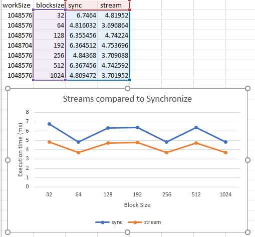

# Analysis

For this chapter we ran just 1 experiement comparing the usage of synchronize and stream
kernels. In Orange we have 4 stream kernels used for each task i.e math operations. This
includes copying over data however by leveraging 4 streams we keep the GPU constantly
busy this makes a pretty consistent bonus of increasing the througput of the GPU in general.
Ourtim is on average 33% faster when we use the streaming method. I imagine doing more 
calculations we further improve the gains. One might ask where are the Events and well 
those were used to get the timing of completion on each experiement. Since the tasks are
so simple it was hard to think of a way to use events will comparing similar varribles. 
Overall I was really impressed with benefit of streams because there setup and management
was very easy. The remind me of threadpools or pipeling because they are vertially free 
performance increases because they allow async activity. 

# Stretch Problem
See the module7_stretch_problem.cu file you can also just run make and it will build and run
the problem storing the output in stretch_prob_out
