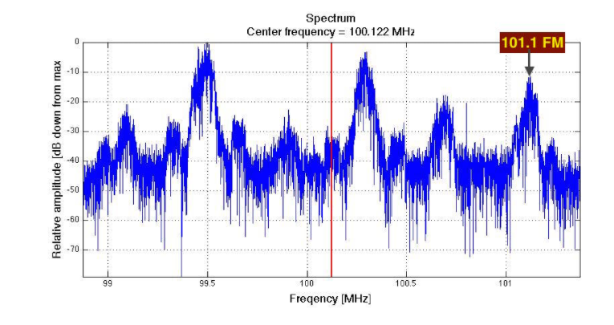

# Overview

For this project I choose to use the cuFFT and cuRAND libraries. The motivation for this 
is my final project, which revolves around demodulating FM signals from a RTL-SDR sampling
IQ data. These are complex sample data that will allow to get our waves. The first step
in this process is finding the actual signals to decode this is were the FFTs come in. 
FFT or Fast Fourier Transforms allow us to transform time series data (IQ samples) to 
the frequency domains. An intutive understanding is that FFT of a set of points will 
isolate out patterns that happen at a set frequency. This will let us find a signal to
decode. The visual nature of this data will require use to plot the data. The best solution
in C for ploting is gnuplot. This will give us the ability to visual our data. Now the 
final aspect is cuRAND we will be comparing random data to a sample IQ data of the FM
specturm. This is the crux of our analysis section we will be testing that cuRAND is 
not generating frequency based data that isn't very random. 

# Analysis

Our first test is to ensure that our FFT program actually works above I have a sample
FFT from [1]. This is a basic FFT of some FFT data and our first task was to test that 
our cuda Generated FFT matches. This data shows 3 spikes at FM states however there are
actually 6 FM stations in this data.  

As we can see we match the reference data very tightly coupled which makes me feel like
algorithmically my FFT is working now. I did learn a that failing to free GPU data will
quickly cause your cuda Device to lock up. After crushing that one bug I think we can 
see the results are very good the next step is to actually do the random testing

After some tinker I got cuRAND working and was able to generate the above plot. This was
perfect the random noise graph. As expect cuRAND is not generating frequency based patterns
and while a very basic test it fits our application very well because it test another 
aspect of our FFT program that random data should just be noise in our FFT. This is an 
important test because finding null points is important when its time decode. 

# References:
[1] http://www.aaronscher.com/wireless_com_SDR/RTL_SDR_AM_spectrum_demod.html

