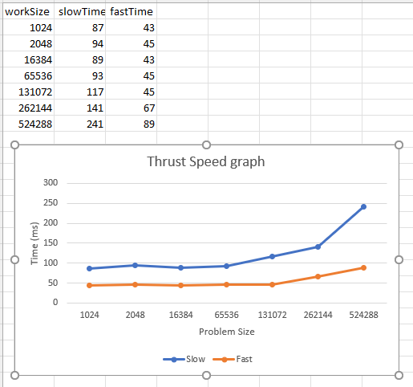

# Overview 

For starters I rely on several cuda examples to generate these extended examples. 
That said my game plan for this unit was to focus mostly on getting things to work
and saving analysis for something that was easily comparable. That meant the only
Analysis I have is for the thrust assignment. It was easy to generate a useful
but also interest comparison there. For that I made a custom functor which was
intersting and seems like you could use it in something that mattered. For the
Graph assignement I ran the SSSP algorithm to generate the shortest path to every
node from a source node. And for the NPP assignement I ran a Edge Detector on a Lena
picture shown below.

# Thrust analysis

First this assignment I made a custom functor and compared it to doing the function
in simple steps. Now this is bad in the sense that you have to prime the GPU several
times in order for the complex operation to execute. In order to get around this
you can use c++ operators to run a more complex function on the gpu. This saves many 
round trips which equals a high savings over large functions. See the graph above

# nvGraph

I ran the SSSP algorithm in order to calculate a all shortest paths from one sink. 
It was hard to generate the CSC encoded files I had to call out to java to make that
scriptable but after that hump using the Lib was also really hard. I'm not sure why
they added so many handle components for these graphs which I think the community
agreed with because nvGraph is deprecated that said I notices the slowest part to using
this lib was loading it mostly which indicates I should have made some bigger graphs
however I don't want to abuse my git profile to store useless data. I verified the results
in another application but thats not shown because doing SSSP by hand in C is complex

# NPP

I ran the Canny Edge detection algorithm on lena. It would have been interesting to find
a way to convert jpg to pgm and back however i couldn't find anything. This was the 
slowest mostly because its consuming the large data set. Overall this was a very straight
forward algorithm to use. It would have been easier to also be able to run this locally but
VM's cannot access a host GPU and windows :( Either way the results for this are in the
pictures
